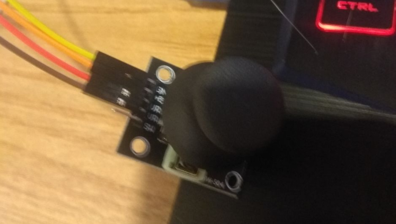

# arduino-game-thingy

Little Arduino game I made to learn stuff

## Connections:
### SSD1306 128x64 LCD Display:
  - GND -> GND
  - VCC -> 5V
  - D0  -> 9  (Digital)
  - D1  -> 10 (Digital)
  - RES -> 11 (Digital)
  - DC  -> 12 (Digital)
  - CS  -> 13 (Digital)
  
### KY-023 Analog Joystick:
  - GND -> GND
  - +5V -> 5V
  - VRx -> A0 (Analog)
  - VRy -> A1 (Analog)

## Pictures:
  
  
  
  
